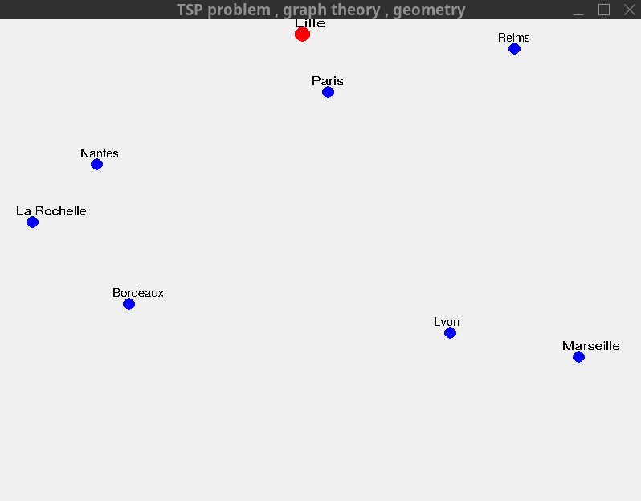
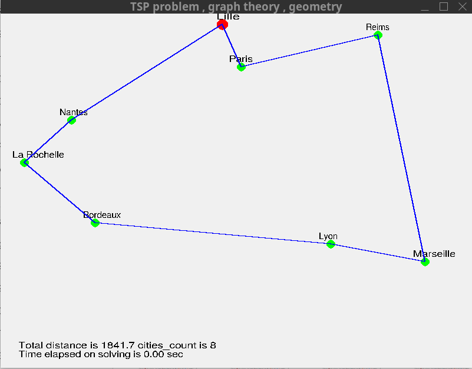
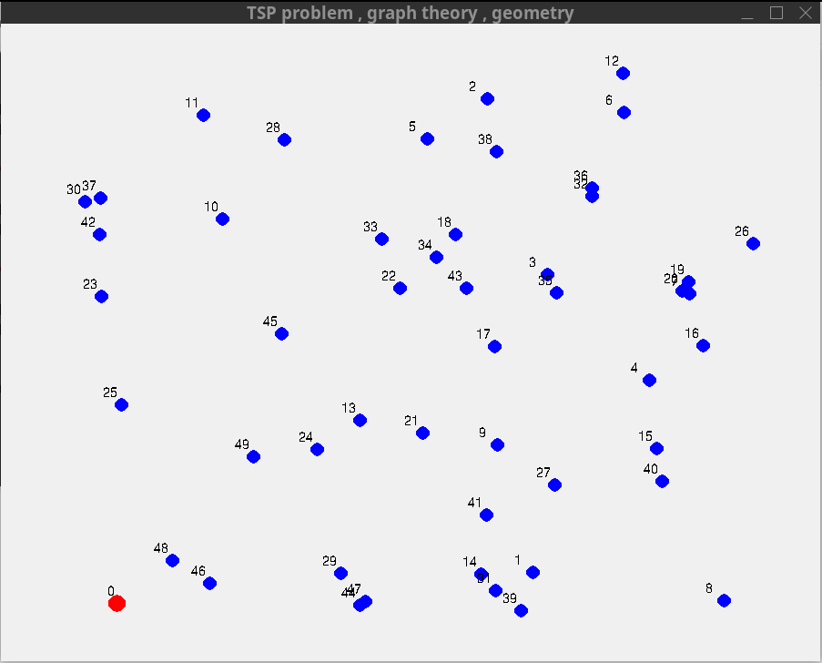
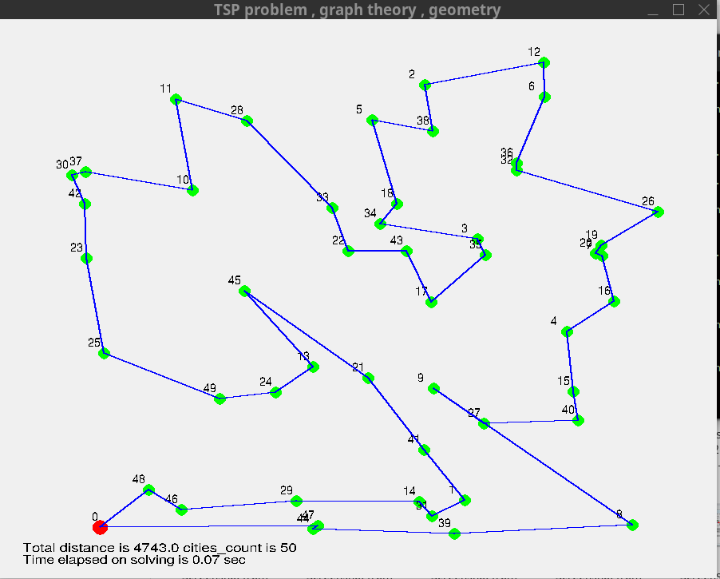
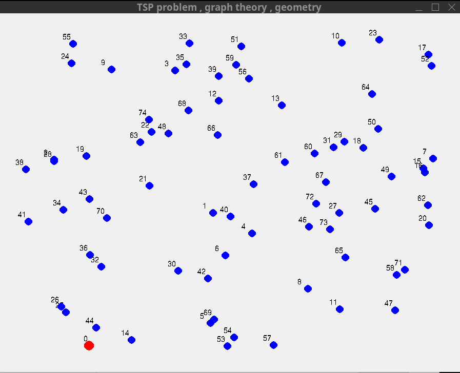
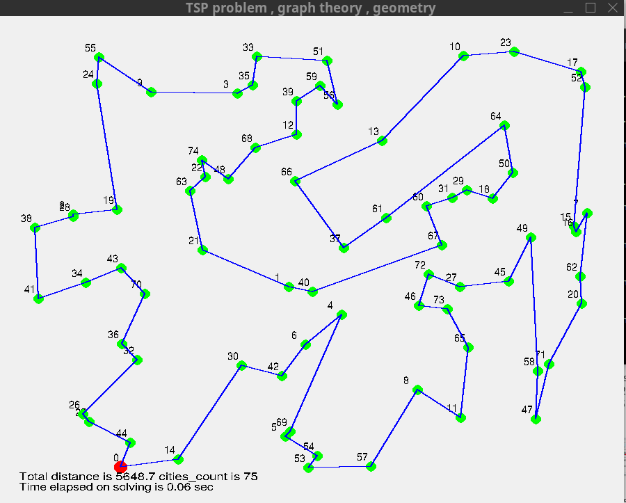
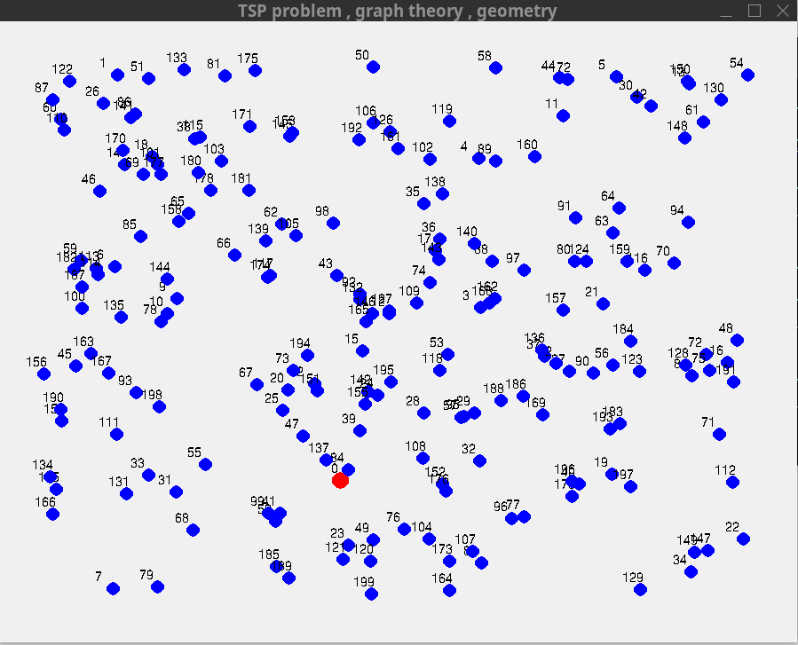
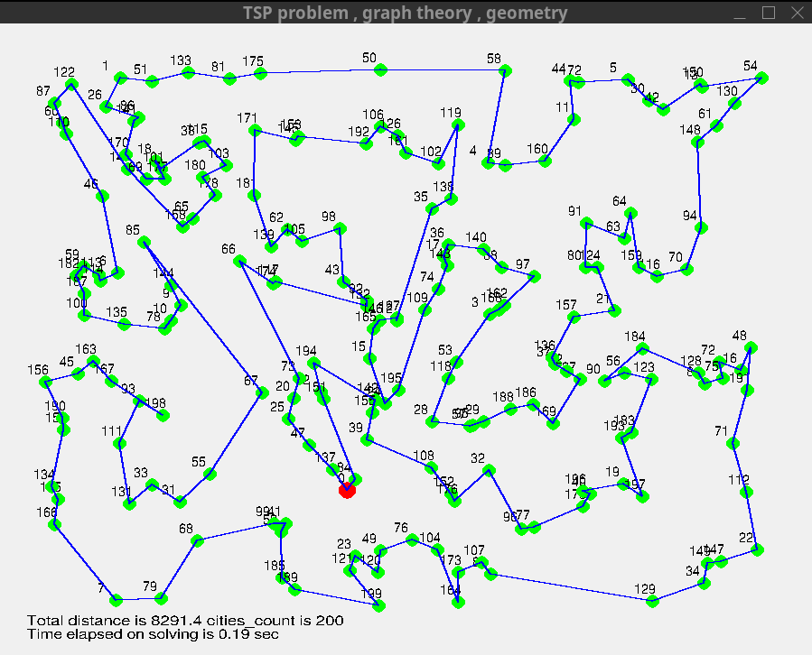

# TSP

Traveling Sales Person (TSP) problem.

An effort to solve TSP using "graph theory" and "geometry" in "SDL2" C graphics library.

Call "./tspN.sh" from code directory in terminal to compile and run the code.

## Some examples:

**France_8**:

**Random_50**:

**Random_75**:

**Random_200**:

Still there seems to be room for improvements.
